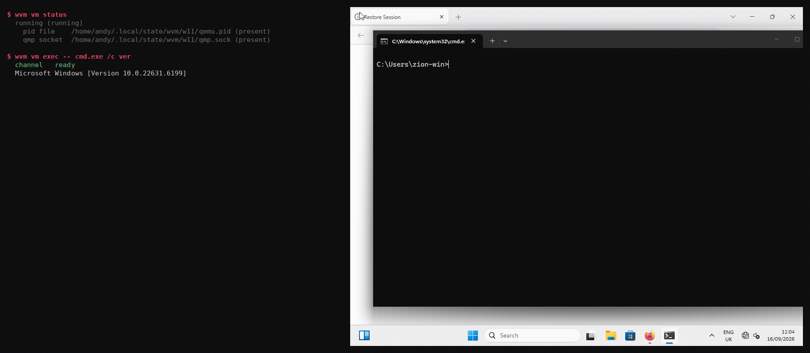

# WVM — a headless execution sandbox for AI agents

Drive Windows 11 from a Linux terminal over a typed, hostile-peer-guarded JSON protocol.

A Rust control plane that lets a program or an agent drive a Windows VM as a typed tool: launch
processes, capture screenshots, inject input, move files, snapshot and restore. Headless by
default, every operation through a capability boundary and an append-only journal.

Give your agent a Windows guest instead of your host machine.



*Left: the typed protocol. Right: the same guest, live, receiving the transfer and running the code.
Both halves are real — the GIF is rendered from the actual commands by
`scripts/make-demo-gif.py`, so it cannot drift from the code or show anything the tool did not do.*

It is **not** a desktop-integration layer. That space is well served — WinBoat (22.8k stars),
WinPodX, winapps, LinOffice all put individual Windows windows on a Linux desktop via FreeRDP and
RemoteApp. WVM exists for the case they do not cover: **an agent or a program driving a Windows
guest over a typed protocol, headless, with an auditable capability boundary.**

**Status: every verb implemented and verified against a live guest** — `exec`, `capture`, `input`,
`transfer push`, `transfer pull`, and snapshots (save, restore, list, delete). Nothing in the
protocol is a stub.

> **Snapshots carry a known risk.** On this Windows 11 build, roughly one `snapshot save` in five
> bugchecks the guest with `0x50 PAGE_FAULT_IN_NONPAGED_AREA`. The fault is inside Windows' own
> kernel — a fixed code offset relative to `PsLoadedModuleList` across four crashes with different
> KASLR bases — and a bare vCPU pause of the same duration does **not** reproduce it, so it is the
> snapshot's device-state write rather than the freeze. It is reproduced, localised and not yet
> fixed. **Do not put anything in a snapshot you cannot afford to lose.** See D-017 and D-018 in
> [`docs/DECISIONS.md`](docs/DECISIONS.md) for the measurements.

## If you are an agent, start here

**→ [`WVM.md`](WVM.md)** is the protocol contract: every verb, the exact responses, and the traps
that cost real time to find. It is generated from the code, so it cannot describe a verb that does
not exist — `scripts/check-docs.sh` fails the build if it drifts.

**→ [`AGENTS.md`](AGENTS.md)** is for an agent changing this codebase: the verification commands,
and the house rules that were learned expensively.

An agent can also ask the binary directly, rather than trust a document:

```sh
wvm capabilities          # what this build can do, as a table
wvm capabilities --json   # the same, for a caller that would rather not parse prose
```

## The one command to run first

Before installing anything, watch the capability boundary work:

```sh
python3 examples/wvm_client.py boundary
```

```
Daemon started with the grant: inspect only

  hello      -> handshake accepted; peer reports: no guest channel yet (M3 not started)
  inspect    -> inventory: os='host (no guest channel yet)', 0 drive(s), 0 app(s)
  capture    -> REFUSED
  lifecycle  -> REFUSED
  exec       -> REFUSED

Every ungranted verb was refused. The grant held.
```

That runs on this machine with nothing but Python installed. It starts a real daemon with a
deliberately narrow grant, then tries to exceed it four times — and the refusals are the product.

`examples/wvm_client.py` is also a second, independent implementation of the wire format, stdlib
only. A protocol with one implementation has no way to notice that its own encoder and decoder
disagree; two implementations surface that immediately.

## What works, verified

Driven from Linux, over the control channel, with no console, no keyboard and no guest-side agent:

```
hello    ->  {"status":"ready","protocol_version":1,"guest":"Windows (wvm-guest 0.1.0)"}

exec     ->  {"result":"process_output","outcome":"exited","code":0,
              "stdout":"\r\nMicrosoft Windows [Version 10.0.22631.2715]\r\n",
              "elapsed_ms":37}

capture  ->  a 1024x768 PNG of the live desktop, 608 distinct colours

input    ->  clicked (336,397) on the Firefox new tab page; Wikipedia loaded

transfer ->  1 MiB pushed in and pulled back, byte-identical both ways
```

A process launched inside Windows, its output captured, returned to the host. A screenshot of the
real desktop. A click that lands where you aimed. **And an artifact the guest produced, extracted
and hash-verified** — which is the difference between a sandbox and a roach motel.

| | |
|---|---|
| Protocol + framing | length-prefixed JSON, 4-byte big-endian, hostile-peer guard |
| Capability boundary | enforced at request **construction**, denials journalled |
| Audit journal | append-only JSON Lines, requests and denials at equal weight |
| QEMU supervision | start, suspend, shutdown, status, serial log |
| Windows install | tiny11, driven by keyboard injection alone, headless |
| Guest networking | e1000e (in-box driver), `10.0.2.15` |
| Guest service | Windows service, `StartServiceCtrlDispatcher`, auto-restart |
| Exec | launch, capture stdout/stderr, caller-supplied timeout, exit status |
| Exec cleanup | a timeout kills the whole process **tree**, not just the direct child |
| Capture | PNG of the live desktop, geometry assertion |
| Input | absolute pointer moves and clicks, UK-correct keys and text |
| Transfer | push and pull, chunked in lockstep, confined to a guest staging root |
| Snapshots | save and restore **live**, RAM included — the guest rolls back, still running. See the risk note above |

## What the guest refuses, and why that is the answer

One verb is answered with a refusal rather than an implementation, and the refusal is permanent:

- **`lifecycle` from inside the guest.** Snapshots are a hypervisor capability. The machine state
  lives in QEMU and the guest has no view of its own hypervisor, so this can never work from that
  side — it is not "not written yet".

The distinction is deliberate and tested. A caller told "not implemented" would reasonably retry
after an upgrade; a caller told the truth stops asking and uses `wvm vm snapshot` on the host, which
the message names. The protocol keeps the verb so the boundary is discoverable by asking, rather
than by a connection timing out.

## Verifying it yourself

```
./scripts/verify-all.sh              # everything, against a live guest
./scripts/verify-all.sh --offline    # only what needs no guest
./scripts/verify-all.sh --list       # what runs, and why
```

Twelve probes, and a result with three states rather than two: **passed**, **failed**, and **could
not run**. That last one is not a pass. A probe that never executed has verified nothing, and
conflating the two is how a build ships on the strength of a check that did not happen.

Every bug in this project's history was found by one of these, and every false claim was caught by
one — so they are wired together rather than left to whoever remembers to run them.

## Known gaps, recorded rather than hidden

- **A request that ignores its deadline no longer holds the channel.** Requests run under a fifteen
  minute backstop and connections are served on their own threads, so a wedged request is abandoned
  and the listener stays reachable (D-015). What is still true: **the abandoned work is not
  cancelled** — Rust cannot safely cancel arbitrary code, so the worker runs to completion. The
  channel is released; the guest's resources are not. A timeout reply says so rather than implying a
  clean stop.
- **The tree-kill has a microseconds-wide window.** The child is assigned to its job object
  immediately after `spawn`, so there is a moment where a process exists outside the job. Closing it
  needs `CREATE_SUSPENDED` + `AssignProcessToJobObject` + `ResumeThread`, which `std::process` does
  not expose. Named rather than described away — see D-013.
- **A guest without a display cannot be captured.** Capture runs against the QEMU framebuffer on the
  host, so it needs QEMU to be rendering. That is inherent, not a bug — and it is why capture is
  host-side at all (see D-009).
- **Snapshots need the VM running, and stop it briefly.** A save freezes the guest CPUs for a few
  seconds while state is written — measured at ~6.5s on a 3.4 GiB machine. The QMP control channel
  is silent during that window, which is why any client read timeout shorter than the pause fails
  intermittently. The job loop here reads with a 60s timeout for exactly that reason.
- **Snapshot size is the RAM, not the delta.** `my-snap` reports 3.37 GiB because it holds the
  machine's memory as well as its disk. That is what makes a restore a rollback rather than a disk
  revert, and it is also why snapshots are worth deleting when they are no longer needed.
- **Input cannot reach every widget.** A page-level overlay that fights synthetic focus may take
  focus and still ignore injected keys. Ordinary Windows controls and browser chrome accept input
  reliably; this is recorded as an observed boundary rather than explained away.

## Quickstart

This walks from a bare Linux host to driving a Windows guest. It takes about an hour, most of it
the Windows install.

### 0. What you need

- **Linux host** with KVM. `/dev/kvm` must be openable by your user. On many distributions this
  needs you in the `kvm` group; check with `test -r /dev/kvm && test -w /dev/kvm && echo ok`.
- **QEMU** 8 or newer, **Rust** 1.70+, and **cargo**.
- **A Windows ISO.** Tiny11 is recommended and is what this project is developed against — see
  [Why Tiny11](#why-tiny11) for the reasoning and where to get it.
- **The virtio-win driver ISO**, from
  `https://fedorapeople.org/groups/virt/virtio-win/direct-downloads/stable-virtio/virtio-win.iso`.
  You need this even though the guest ends up needing no virtio drivers at runtime: it is what
  makes the OS disk visible to Windows Setup.
- **~40 GB free disk** (a 64 GiB sparse disk and a Windows install).

### 1. Check the host can run this

```sh
cargo run --release -p wvm-host -- doctor
```

This reports KVM, QEMU, the cross-compile target and the toolchain, and it **attempts** each
operation rather than inspecting metadata. If it says something is missing, fix that first — every
later step assumes it.

### 2. Cross-compile the guest agent

```sh
rustup target add x86_64-pc-windows-gnu
cargo build --release --target x86_64-pc-windows-gnu -p wvm-guest
```

You need `x86_64-w64-mingw32-gcc` installed as the linker. On Debian/Ubuntu:
`sudo apt install gcc-mingw-w64-x86-64`. The result is
`target/x86_64-pc-windows-gnu/release/wvm-guest.exe`, a little under 600 KB. It links only against
core Windows DLLs — `KERNEL32`, `msvcrt`, `ntdll`, `WS2_32` — so it needs no Visual C++
redistributable in the guest.

### 3. Generate the VM configuration

```sh
./scripts/prepare-install.sh --iso /path/to/tiny11.iso
```

This writes two files under `~/wvm/`: `install.toml` (the installer ISO attached) and `wvm.toml`
(the long-lived profile, no installer). **Read them.** They are the whole VM definition and they are
short.

### 4. Install Windows, headless

```sh
wvm vm cmdline --config ~/wvm/install.toml   # read the command line before running it
wvm vm start   --config ~/wvm/install.toml --timeout 300
wvm vm log     --config ~/wvm/install.toml --lines 60
```

**Windows Setup will not see the disk on the first screen.** That is expected and it is the
[catch-22](#the-virtio-storage-catch-22): the OS disk is on `virtio-blk` for speed, and Setup needs
a driver it can only load from a disc on a bus it can already read. When Setup offers no disk,
click **Load driver → Browse → the driver disc → `viostor` → `w11` → `amd64`**. The disk appears.

Complete the install through the GUI. Watch it with a window if you prefer:

```sh
python3 scripts/vm-with-display.py --display gtk ~/wvm/install.toml
```

### 5. Boot the installed guest

```sh
./scripts/start-windows.sh              # windowed
./scripts/start-windows.sh --headless   # no display
./scripts/vm-health.sh                  # is anything actually wrong?
```

### 6. Install the guest service

Inside the guest, **in an elevated PowerShell**:

```powershell
sc.exe create wvm-guest binPath= "C:\Program Files\wvm\wvm-guest.exe" --service start= auto
sc.exe start  wvm-guest
sc.exe query  wvm-guest
```

`scripts/install-guest-service.ps1` does this plus the firewall rule, and is the path to prefer —
copy the binary and the script into the guest, then run the script elevated. Full detail, including
how to get files into the guest, is in `docs/WINDOWS-INSTALL-STATUS.md`.

Note `sc.exe`, not `sc`: in PowerShell `sc` is an alias for `Set-Content` and will fail with a
confusing "positional parameter" error.

### 7. Drive it

```sh
python3 scripts/talk-to-guest.py hello
python3 scripts/talk-to-guest.py exec -- cmd.exe /c ver

# the host binary also does capture, input and file transfer
wvm vm capture  --config ~/wvm/wvm.toml --out /tmp/screen.png --expect 1024x768
wvm vm input    click --config ~/wvm/wvm.toml 336 397
wvm vm input    text  --config ~/wvm/wvm.toml 'hello from the host'

# move a file in, and get an artifact back out
wvm vm transfer push --config ~/wvm/wvm.toml ./payload.bin 'C:\ProgramData\wvm\staging\payload.bin'
wvm vm transfer pull --config ~/wvm/wvm.toml 'C:\ProgramData\wvm\staging\result.bin' ./result.bin

# snapshot before letting something risky run, and roll back after
wvm vm snapshot save before-install --config ~/wvm/wvm.toml
wvm vm snapshot list               --config ~/wvm/wvm.toml
wvm vm snapshot restore before-install --config ~/wvm/wvm.toml
```

A snapshot takes the machine's **memory as well as its disk**, so a restore returns the guest to the
state it was in — running, with its windows open — not just to an earlier disk image. That is the
difference between undoing something and reinstalling it.

Note the argument order for `pull`: the names are written for a push, so they **invert**. `SOURCE`
is the **guest** file being fetched and `GUEST_PATH` is the **host** destination. Getting it
backwards sends your local path to the guest, which refuses it as outside its staging root — an
error that looks like a boundary problem rather than a swapped argument.

## Why Tiny11

**Tiny11** is Windows 11 Pro with the consumer surface stripped out. Around 3 GB installed, versus
20 GB+ for a stock ISO once telemetry, Edge components and the background service set are included.

Tiny11 was chosen for an agent sandbox specifically, not for novelty:

- **Everything the control plane needs is present.** Win32 APIs, the Service Control Manager, and
  the interactive Session 1 desktop subsystem. Those are the parts that matter, and none of them
  are removed.
- **Less to move and less to watch.** For an ephemeral sandbox, baseline memory footprint and I/O
  latency matter more than features nobody will use.
- **Fewer background services means fewer things that can fire mid-operation**, and a shorter boot.

The trade is that Tiny11 is a community build rather than an official Microsoft image. For a
disposable sandbox that is the right trade; for anything holding data you care about, install from
an official ISO and expect a larger, slower guest.

**Verified against:** `Microsoft Windows [Version 10.0.22631.2715]` — the string the guest returns
from `exec -- cmd.exe /c ver`, which is the honest way to confirm what you actually built.

## The virtio storage catch-22

Windows Setup cannot see the OS disk, because that disk is on `virtio-blk` for speed and Setup has
no virtio driver yet. So a second disc carries the driver.

**The driver disc must be on a bus Setup can already read — AHCI, not virtio.** Attaching the driver
disc to a virtio controller is a genuine circular dependency: Setup cannot read the disc that
contains the driver that would let it read a disc. The symptom is "No device drivers were found"
with nothing but `Boot(X:)` to browse, which looks like a broken image rather than a bus mismatch.

```
OS disk          virtio-blk          fast, invisible to Setup until the driver loads
driver ISO       AHCI port 0         readable by Setup, because AHCI is in-box
installer ISO    AHCI port 1         a separate port, not a second unit on the first
```

Both discs need **separate AHCI ports**. One IDE unit cannot carry two CD-ROMs on q35.

Full detail, including how each of these was found, is in `docs/WINDOWS-INSTALL-STATUS.md`.

## Execution modes

### Headless (the default)

No display is attached and the framebuffer is not instantiated. This is the primitive: a typed,
auditable channel with no UI in the loop.

```sh
./scripts/start-windows.sh --headless
python3 scripts/talk-to-guest.py exec -- cmd.exe /c ver
```

Lower memory footprint, faster boot, and nothing in the loop that a human is expected to read. Use
this for agent execution. Capture still works here — it reads the framebuffer QEMU is rendering even
when no window is shown.

### Windowed (visual telemetry)

Attach a display when you want to watch what the agent is doing — absolute pointer positioning, a UI
that did not respond as expected, a guest mid-boot.

```sh
./scripts/start-windows.sh                    # GTK window on the host
python3 scripts/vm-with-display.py --display vnc ~/wvm/wvm.toml
```

For VNC, point Remmina (or any viewer) at `127.0.0.1:5900` — bound to loopback, no password, so do
not forward that port. `--display sdl` also works if GTK misbehaves under your compositor.

`--vnc-port N` moves it if 5900 is taken.

### Working in the guest by hand

Watching is the small half of this. The display is a **real interactive session**, so you can also
take the keyboard and do the things an agent should not be trusted to do unattended: run an installer
that wants a licence click, log into a Microsoft account, set a password, install a driver, or debug
the app your agent is failing to drive.

Three things make that practical:

**Type into it.** Send keystrokes to the guest's console without a display attached at all — useful
when you want to hand-type one command into a headless VM:

```sh
python3 scripts/qmp_input.py <socket> text "winget install --id Git.Git"
python3 scripts/qmp_input.py <socket> key ret
```

**Screenshot without watching.** `wvm vm capture` returns a PNG of whatever the desktop currently
shows, so a script can record what happened rather than a human having to sit there.

**Paste a command from the host.** Type it in the window, or use `Run` (`Meta+R`) when you want a
clean single command rather than a shell prompt.

Practicalities worth knowing, each learned the hard way:

- The guest runs a **UK keyboard layout**. If yours differs, characters arrive shifted — quote marks
  and backslashes are the usual casualties.
- `Ctrl+Alt+G` releases the mouse **only if a grab is active**. The generated command line uses a
  plain `-display gtk` with no `grab-on-hover`, so nothing grabs and there is nothing to release. If
  you add a grab option yourself, that is the key that frees it.
- UAC prompts need a real click. Driving them through emulated input is unreliable, and when a
  prompt is waiting the agent's commands will appear to hang with no visible reason.

You will see the exact desktop the agent is manipulating, because input arrives as **emulated USB
hardware** (`usb-tablet`) rather than through any Windows API, and the guest's own Session 1 desktop
renders it. That indirection is what makes headless `input` work at all — see
[why input is emulated hardware](#why-input-is-emulated-hardware).

## Two more things that will bite you

Both are covered above; they are repeated here because they cost the most time and each presents as
something else entirely.

**A firmware mismatch is silent.** An unbootable disk under the wrong firmware produces no error —
the firmware just shows its boot menu, which looks like "the install failed". `wvm vm start` reads
the partition table and refuses a mismatch by name rather than letting you debug a symptom.

**A TCP connect to the guest port proves nothing.** QEMU's user-mode networking completes the
handshake on the host's behalf and only then attempts delivery, so a connect succeeds against a
guest with nothing listening. Use `scripts/talk-to-guest.py`, which exchanges real frames and says
so in its output.

## Why input is emulated hardware

This is the design decision that makes most of the tool possible, so it is worth stating plainly.

**A Windows service cannot inject input into the desktop.** Services run in **session 0**, an
isolated session with no desktop, and `SendInput` from there cannot reach session 1 where the user
(and any GUI application) lives. The only supported route is `CreateProcessAsUser` with
`lpDesktop = "winsta0\default"`, which needs `SE_TCB_NAME` and spawns a process per event.

**Emulated hardware has no such restriction.** Input sent over QMP arrives as PS/2 and USB device
events, and the Windows kernel delivers those to whichever session owns the **active console** —
session 1. No Windows API is involved, so the isolation boundary never applies.

The same reasoning applies to screen capture. The guest cannot screenshot its own desktop from
session 0, so capture reads QEMU's framebuffer on the host instead (D-009).

Practical consequences:

- `input` and `capture` need QEMU running. They are host-side operations.
- A guest with no display device cannot be captured at all — honestly reported, rather than
  returning a black image that looks like a dark screen.
- Absolute pointer positioning needs a `usb-tablet` on a USB controller. Without one QEMU exposes
  only a relative mouse, and a coordinate cannot be expressed at all.

Full reasoning in `docs/DECISIONS.md` D-009, D-010 and D-011.

## Why the odd decisions

Recorded so they are not re-litigated. Full reasoning in `docs/DECISIONS.md`.

- **TCP, not virtio-vsock** (D-002). Windows has no native `AF_VSOCK`; the virtio-win `viosock`
  driver was withheld for years and only entered the release at build 285, with a field failure
  mode of `Connection reset by peer`. Both shipping projects in this space rejected it.
- **Headless by default** (D-004). The plane must work with no display attached.
- **A diagnostic attempts the operation** (D-005). `/dev/kvm` reported as inaccessible because the
  user was not in the `kvm` group — while an ACL made it openable. Metadata lied; attempting the
  open told the truth.
- **e1000e, not virtio-net.** virtio-net is faster and needs a driver installed *inside* the guest
  before any adapter exists. On a fresh install the guest enumerated no network interface while
  every host-side check reported healthy — the forward was bound, the device was attached, and a
  TCP connect succeeded. e1000e uses the Windows in-box driver.
- **Capture on the host, not in the guest** (D-009). Session 0 isolation, as above.
- **Transfers are chunked at 256 KiB** (see `wvm-guest/src/fsio.rs`). Not because the frame limit
  requires it — frames carry up to 64 MiB — but because one frame per file means the whole file in
  memory on both sides at once, and a transfer that dies halfway would be indistinguishable from a
  small successful one.
- **The keymap is measured, never derived** (D-011). It was written for a US keyboard on a UK guest,
  and each wrong entry presented as a different fault: a bad quote looked like a permissions
  problem, a bad backslash looked like a missing driver.

## Layout

```
wvm-ipc/     wire protocol and framing — shared by host and guest, so they cannot desync
wvm-host/    the Linux daemon: CLI, QEMU supervision, control socket, policy gate, journal
wvm-guest/   the Windows service: transport, dispatch, Win32 execution, path containment
docs/        design record — decisions, verified environment, build plan, install status, origin
scripts/     tooling, each written for a specific failure that cost time
examples/    a dependency-free Python client, and an executable demonstration of the gate
```

## Licence

MIT.
